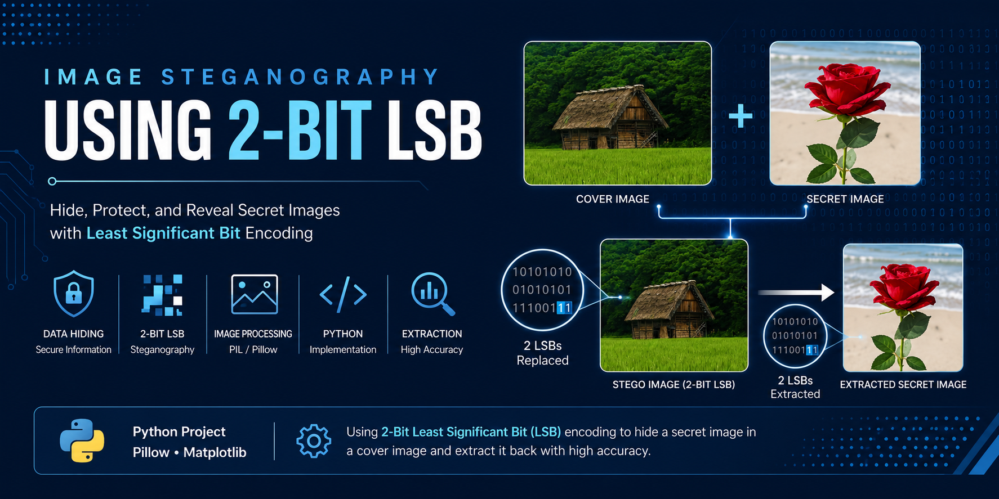
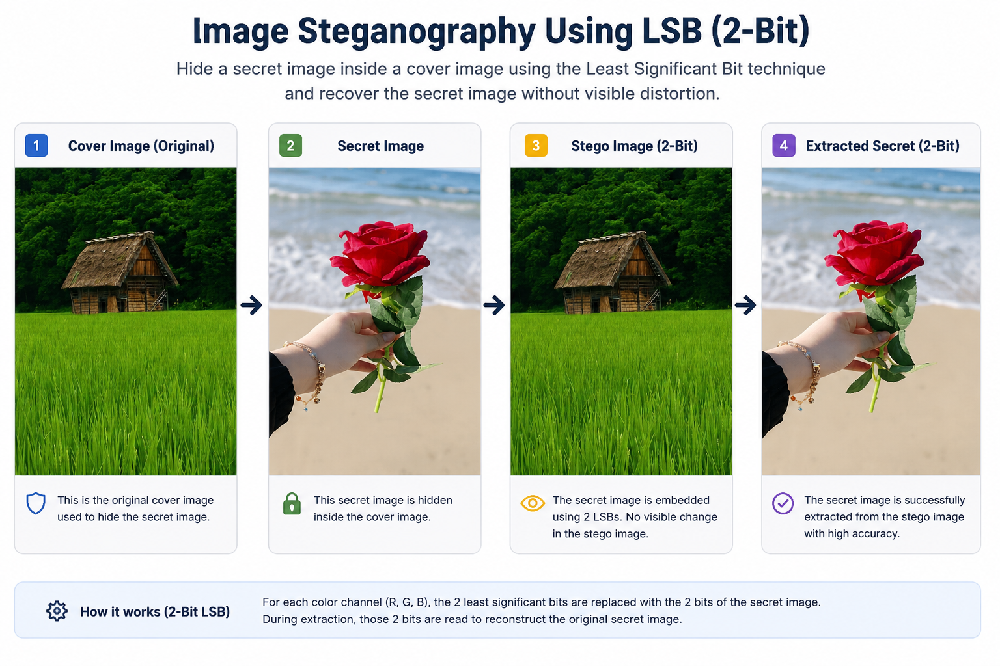

# 🖼️ Image Steganography Using 2-Bit LSB

<p align="center">
  
</p>

<h3 align="center">
  Hiding and Extracting Secret Images Using 2-Bit Least Significant Bit Encoding
</h3>

---

## 📌 Project Overview

This project implements an image steganography technique based on **2-Bit Least Significant Bit (LSB) encoding**.

The system hides a secret image inside a cover image by replacing the two least significant bits of each RGB color channel with information extracted from the secret image.

The hidden image can then be recovered from the resulting stego image through a reverse bitwise extraction process.

---

## 🎯 Objectives

- Hide a secret image inside a cover image
- Implement 2-Bit LSB image steganography
- Perform pixel-level bit manipulation
- Extract the hidden image from the stego image
- Visualize the embedding and extraction process
- Demonstrate the practical use of bitwise operations in image processing

---

## 🔄 Steganography Workflow

```text
Cover Image
     +
Secret Image
     ↓
Secret Image Resizing
     ↓
2-Bit LSB Embedding
     ↓
Stego Image
     ↓
2-Bit LSB Extraction
     ↓
Extracted Secret Image
```
🧠 How 2-Bit LSB Steganography Works

Each pixel contains three color channels:

Red (R)   Green (G)   Blue (B)

Each channel is represented using 8 bits.

In this implementation, the two least significant bits of each cover image channel are replaced with the two most significant bits of the corresponding secret image channel.

### Embedding

The two least significant bits of each cover image channel are replaced with the two most significant bits of the corresponding secret image channel.

This process preserves most of the original cover image information while embedding the secret image data into the pixel values.
The last two bits of each cover channel are cleared, and information from the secret image is inserted using bitwise operations.

🔐 Embedding Process

The secret image is first resized to match the dimensions of the cover image.

For each pixel, the two most significant bits of the secret image are embedded into the two least significant bits of the corresponding cover image channel.

r = (r_c & 0xFC) | (r_s >> 6)
g = (g_c & 0xFC) | (g_s >> 6)
b = (b_c & 0xFC) | (b_s >> 6)

Where:

& 0xFC clears the two least significant bits of the cover channel
>> 6 extracts the two most significant bits of the secret channel
| inserts the secret information into the cover channel

The result is saved as the stego image.

🔓 Extraction Process

During the extraction process, the two least significant bits are retrieved from each color channel of the stego image.

r_s = (r & 0x03) << 6
g_s = (g & 0x03) << 6
b_s = (b & 0x03) << 6

The extracted bits are shifted back to reconstruct the intensity values of the hidden image.

The recovered image is then saved as the extracted secret image.

## 📊 Results

The complete steganography workflow is illustrated below:

<p align="center">
  
</p>

The workflow demonstrates the complete process:

```text
Cover Image → Secret Image → Stego Image → Extracted Secret Image

```
The secret image can be successfully recovered from the stego image using the 2-Bit LSB extraction process.

🛠️ Technologies & Libraries
Python
Pillow (PIL) — Image processing and manipulation
Matplotlib — Image visualization
Bitwise Operations — Pixel-level data manipulation
📂 Project Structure
Image-Steganography-Using-LSB/
│
├── Assets/
│   └── Image-Steganography-2-Bit-LSB-Banner.png
│
├── Data/
│   ├── cover.jpg
│   ├── secret.jpg
│   ├── stego_2bit.png
│   └── extracted_secret_2bit.png
│
├── Screenshots/
│   └── steganography-workflow.png
│
├── image_steganography_lsb.py
│
├── requirements.txt
│
└── README.md
🚀 How to Run
1. Clone the Repository
git clone https://github.com/somayehforouzandeh/Image-Steganography-Using-LSB.git
2. Install Dependencies
pip install -r requirements.txt
3. Run the Project
python image_steganography_lsb.py

The program will:

Resize the secret image to match the cover image
Embed the secret image using 2-Bit LSB encoding
Generate the stego image
Extract the hidden image
Save the recovered secret image
Display the results using Matplotlib
💡 Key Takeaway

This project demonstrates how low-level bitwise operations can be applied to image processing and data hiding.

By replacing only two least significant bits of each RGB channel, a secret image can be embedded into a cover image and later reconstructed through a reverse bit manipulation process.

The project provides a practical introduction to:

Image Steganography
Least Significant Bit Encoding
Bitwise Operations
Pixel-Level Image Processing
Python Image Manipulation
👩‍💻Author

Somayeh Forouzandeh

Industrial Engineer | Business Intelligence | Data Analytics

⭐ Explore the code and visual workflow to understand how 2-Bit LSB steganography can be implemented using Python.
